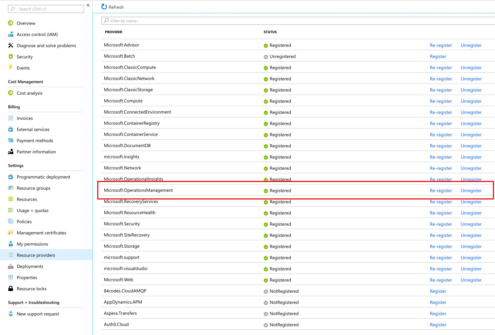

# aks-netcore-netdc18
Sample Code / Snippets for .NET Developer Conference 2018 #netdc18

## Azure DevOps requirements
- Enable Microsoft.OperationsManagement Resource Provider in subscription


Otherwise AKS Cluster deployment will fail with this error:
> Message: The subscription is not registered to use namespace ‘Microsoft.OperationsManagement’. See https://aka.ms/rps-not-found for how to register subscriptions

- [Connect your Azure DevOps organization to Azure Active Directory](https://docs.microsoft.com/en-us/azure/devops/organizations/accounts/connect-organization-to-azure-ad?view=vsts&tabs=new-nav#connect-your-organization-to-your-azure-ad)

## ASP.NET Core / SDK-Versions
https://dotnet.microsoft.com/download/dotnet-core/current

## Install Azure CLI
https://docs.microsoft.com/en-us/cli/azure/install-azure-cli?view=azure-cli-latest

## Login
```
az login
```

## Select Subscription
```
az account set --subscription <subscriptionId>
```

## Create a resource group
```
az group create --name netdc18 --location westeurope
```

## Create a AKS cluster
```
az aks create --resource-group netdc18 --name netdc18 --node-count 1 --enable-addons monitoring --generate-ssh-keys
```

## Install kubectl
```
az aks install-cli
```

## Browse dashboard
```
az aks browse --resource-group netdc18 --name netdc18
```

Create a `ClusterRoleBinding` for RBAC-Clusters (like AKS)
https://docs.microsoft.com/de-de/azure/aks/kubernetes-dashboard#for-rbac-enabled-clusters

Otherwise you'll get errors when opening the dashboard:


## Build, tag, push public images
```
docker build -t pdmlab/netdc18-frontend .
docker build -t pdmlab/netdc18-backend .
docker push pdmlab/netdc18-frontend
docker push pdmlab/netdc18-backend
```

(Replace `pdmlab` with your Docker Hub username/organization)

## Deploy using public images
```
kubectl apply -f deployment.yaml
```

## Create a namespace for private image deployment
```
kubectl create namespace netdc18private
```

## Create k8s secret for Azure ACR
```
kubectl --namespace=netdc18private create secret docker-registry regcred --docker-server=netdc18.azurecr.io --docker-username=<your-name> --docker-password=<your-pword> --docker-email=<your-email>
```

## Login to ACR
```
docker login -p <youracrpassword> -u <youracruser> netdc18.azurecr.io
```

## Build, tag, push private images
```
docker build -t netdc18.azurecr.io/netdc18-frontend .
docker build -t netdc18.azurecr.io/netdc18-backend .
docker push netdc18.azurecr.io/netdc18-frontend
docker push netdc18.azurecr.io/netdc18-backend
```

## Deploy using private images
```
kubectl --namespace=netdc18private apply -f deployment-private.yaml
```

